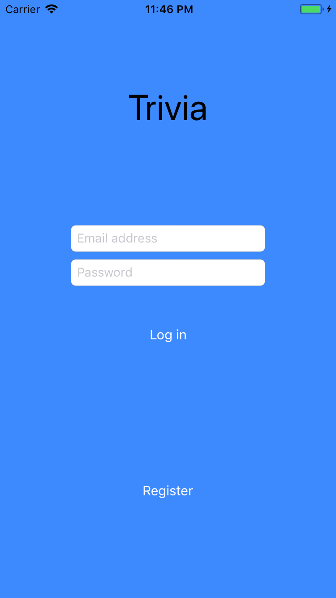

# Trivia - Native App Studio week 6
Vincent K - 11011041

## Description

This app was made for the University of Amsterdam course Native App Studio (5062NAAS6Y). The app is a trivia app that lets the user log in and/or register through Google Firebase. After logging in, a game can be played. Questions are retrieved from the jservice.io API. At the end of the game, the player's score is automatically uploaded to a Firebase database that stores high scores for every player. The Results view shows the player's score and the leaderboard.

## Screenshot

